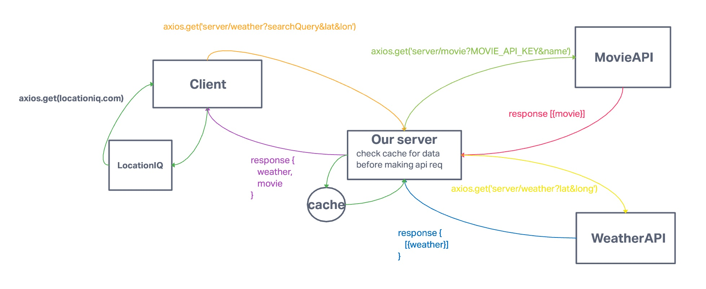

# City Explorer

**Author**: David Suy
**Version**: 1.0.0

## Overview

City explorer allows you to search for a city. Then you will be given a map, weather, and a list of movies that has the city name in it.

## Getting Started

To get started make .env file, follow .env.sample then install npm

## Architecture

JavaScript, Node js, Express js

## Change Log

08-24-2022 4:59pm - Application now has a fully-functional.

## Credit and Collaborations

Code fellows

---

## WRRC

## Time Estimates

Name of feature: set up server

Estimate of time needed to complete: 2 hours

Start time: 1400

Finish time: 1600

Actual time needed to complete: 2 hours

---

Name of feature: add weather info

Estimate of time needed to complete: 2 hours

Start time: 1400

Finish time: 1600

Actual time needed to complete: 2 hours

---

Name of feature: add movie info

Estimate of time needed to complete: 2 hours

Start time: 1400

Finish time: 1600

Actual time needed to complete: 2 hours

---

Name of feature: modulize backend

Estimate of time needed to complete: 2 hours

Start time: 1400

Finish time: 1600

Actual time needed to complete: 2 hours
